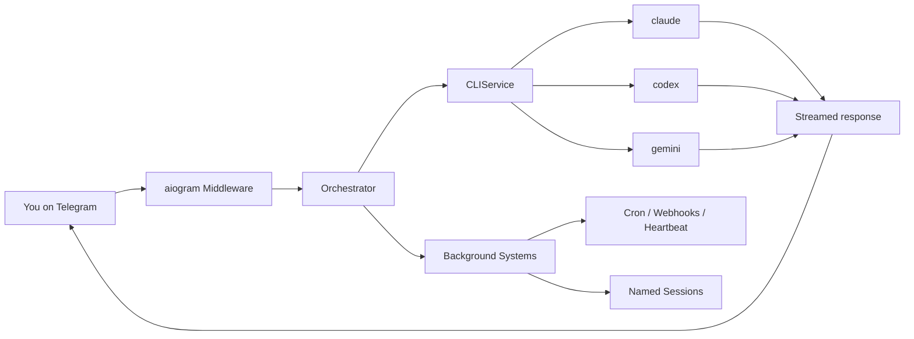

<p align="center">
  
</p>

<p align="center">
  <strong>Claude Code, Codex CLI, and Gemini CLI as your Telegram assistant.</strong><br>
  Named sessions. Persistent memory. Scheduled tasks. Live streaming. Docker sandboxing.<br>
  Uses only official CLIs. Nothing spoofed, nothing proxied.
</p>

<p align="center">
  <a href="https://pypi.org/project/ductor/"></a>
  <a href="https://pypi.org/project/ductor/"></a>
  <a href="https://github.com/PleasePrompto/ductor/blob/main/LICENSE"></a>
</p>

<p align="center">
  <a href="#quick-start">Quick start</a> &middot;
  <a href="#features">Features</a> &middot;
  <a href="#how-it-works">How it works</a> &middot;
  <a href="#telegram-commands">Commands</a> &middot;
  <a href="docs/README.md">Docs</a> &middot;
  <a href="#contributing">Contributing</a>
</p>

---

Use your Claude Max, GPT Pro, or Gemini Pro subscription with ductor. Control your coding agents via Telegram -- automations, cron jobs, named sessions, and more.

ductor runs on your machine, uses your existing CLI authentication, and keeps state in plain JSON/Markdown under `~/.ductor/`.

<p align="center">
  
  
</p>

## Quick start

```bash
pipx install ductor
ductor
```

The onboarding wizard handles CLI checks, Telegram setup, timezone, optional Docker, and optional background service install.

**Requirements:** Python 3.11+, at least one CLI installed (`claude`, `codex`, or `gemini`), a Telegram Bot Token from [@BotFather](https://t.me/BotFather), and either at least one Telegram user ID in `allowed_user_ids` or `group_mention_only=true`.

Detailed setup: [`docs/installation.md`](docs/installation.md)

## Why ductor?

ductor executes the real provider CLIs as subprocesses. No API proxying, no spoofing.

Other projects manipulate SDKs or patch CLIs and risk violating provider terms of service. ductor simply runs the official CLI binaries as if you typed the command in your terminal. Nothing more.

- Official CLIs only (`claude`, `codex`, `gemini`)
- Rule files are plain Markdown (`CLAUDE.md`, `AGENTS.md`, `GEMINI.md`)
- Memory is one Markdown file (`memory_system/MAINMEMORY.md`)
- All state is JSON (`sessions.json`, `cron_jobs.json`, `webhooks.json`)

## Features

### Core

- Real-time streaming with live Telegram edits
- Provider/model switching with `/model` (sessions are preserved per provider)
- `@model` directives for inline provider targeting
- Inline callback buttons, queue tracking with per-message cancel
- Persistent memory in plain Markdown

### Named sessions

Run tasks in the background while you keep chatting. Each session gets a unique name and supports follow-ups:

```text
/session Fix the login bug              -> starts "firmowl" on default provider
/session @codex Refactor the parser     -> starts "pureray" on Codex
/session @opus Analyze the architecture -> starts "goldfly" on Claude (opus)
/session @flash Check the logs          -> starts "slimelk" on Gemini (flash)

@firmowl Also check the tests           -> foreground follow-up
/session @firmowl Add error handling     -> background follow-up

/sessions                                -> list/manage active sessions
```

`@model` shortcuts resolve the provider automatically (`@opus` = Claude, `@flash` = Gemini, `@codex` = Codex).

### Sessions vs. Subagents

ductor has two ways to run work in the background — they solve different problems:

| | `/session` (Named Sessions) | `/agents` (Subagents) |
|---|---|---|
| **What it is** | Background task in **your** agent | A **separate** agent with its own Telegram bot |
| **Workspace** | Same workspace as main chat | Own workspace, own memory |
| **Provider** | Any provider/model per session | Own default provider/model |
| **Communication** | Result appears as Telegram reply | Result flows back into your main chat context |
| **Use case** | Quick parallel tasks you want to track | Dedicated specialist (e.g., Codex for code, Gemini for research) |
| **Setup** | None — just `/session <prompt>` | `ductor agents add <name>` + BotFather token |

**Rule of thumb:** Use `/session` when you want the same agent to do something on the side. Use subagents when you want a different agent (possibly a different provider) to handle an independent workload — your main agent delegates, receives the result with full context, and reports back to you.

### Multi-agent system

Run multiple CLIs as independent Telegram bots that can talk to each other. Each agent gets its own bot token, workspace, and memory — but they share knowledge through `SHAREDMEMORY.md`.

**Setup:** Create a second bot via [@BotFather](https://t.me/BotFather), then:

```bash
ductor agents add codex-agent
```

**Example: Claude as main agent, Codex as sub-agent**

```text
# Each agent has its own Telegram chat — use them independently:
Main chat (Claude):  "Explain the auth flow in this codebase"
Sub-agent chat (Codex):  "Refactor the parser module"

# Or delegate from main to sub-agent:
Main chat:  "Ask codex-agent to write tests for the API module"
  → Claude sends the task to Codex
  → Codex executes, result comes back to your main chat

# Async delegation — keep chatting while Codex works:
Main chat:  "Give codex-agent a task: migrate the database schema"
  → Returns immediately, you keep talking to Claude
  → Codex finishes → result delivered to your main chat
```

**What you can do:**

- Chat with each CLI in its own Telegram bot, simultaneously
- Delegate tasks from main to sub-agent (sync or async)
- Let Claude plan and Codex execute — or any combination
- Share facts across all agents via shared memory

```text
/agents                     # Status of all agents with current model
/agent_commands             # Full multi-agent command reference
```

### Automation

- **Cron jobs:** in-process scheduler with timezone support, per-job overrides, quiet hours
- **Webhooks:** `wake` (inject into active chat) and `cron_task` (isolated task run) modes
- **Heartbeat:** proactive checks in active sessions with cooldown + quiet hours
- **Config hot-reload:** safe fields update without restart (mtime-based watcher)

### Infrastructure

- **Service manager:** Linux (systemd), macOS (launchd), Windows (Task Scheduler)
- **Docker sandbox:** sidecar container with configurable host mounts
- **Multi-agent runtime:** main agent + sub-agents, each with own Telegram bot, sync/async delegation, shared memory
- **Auto-onboarding:** interactive setup wizard on first run
- **Cross-tool skill sync:** shared skills across `~/.claude/`, `~/.codex/`, `~/.gemini/`

## How it works



The orchestrator routes messages through command dispatch, directive parsing, and conversation flows. Background systems (cron, webhooks, heartbeat, named sessions, config reload, model caches) run as in-process asyncio tasks.

Session behavior:
- Sessions are chat-scoped and provider-isolated
- `/new` resets only the active provider bucket
- Switching providers preserves each provider's session context

## Telegram commands

| Command | Description |
|---|---|
| `/session <prompt>` | Run named background session |
| `/sessions` | View/manage active sessions |
| `/model` | Interactive model/provider selector |
| `/new` | Reset active provider session |
| `/stop` | Abort active run |
| `/stop_all` | Abort active runs across all agents (main agent; local fallback on sub-agents) |
| `/status` | Session/provider/auth status |
| `/memory` | Show persistent memory |
| `/cron` | Interactive cron management |
| `/showfiles` | Browse `~/.ductor/` |
| `/diagnose` | Runtime diagnostics |
| `/upgrade` | Check/apply updates |
| `/agents` | Multi-agent status with current models |
| `/agent_commands` | Multi-agent command reference |
| `/info` | Version + links |

## CLI commands

```bash
ductor                  # Start bot (auto-onboarding if needed)
ductor stop             # Stop bot
ductor restart          # Restart bot
ductor upgrade          # Upgrade and restart
ductor status           # Runtime status

ductor service install  # Install as background service
ductor service logs     # View service logs

ductor docker enable    # Enable Docker sandbox
ductor docker rebuild   # Rebuild sandbox container
ductor docker mount /path  # Add host mount

ductor agents list      # List configured sub-agents
ductor agents add NAME  # Add a sub-agent
ductor agents remove NAME  # Remove a sub-agent

ductor api enable       # Enable WebSocket API (beta)
```

Full CLI reference: [`docs/modules/setup_wizard.md`](docs/modules/setup_wizard.md)

## Workspace layout

```text
~/.ductor/
  config/config.json        # Bot configuration
  sessions.json             # Chat session state
  named_sessions.json       # Named background sessions
  cron_jobs.json            # Scheduled tasks
  webhooks.json             # Webhook definitions
  SHAREDMEMORY.md           # Shared knowledge across all agents
  agents.json               # Sub-agent registry (optional)
  agents/                   # Sub-agent homes/workspaces
  CLAUDE.md / AGENTS.md / GEMINI.md  # Rule files
  logs/agent.log
  workspace/
    memory_system/MAINMEMORY.md      # Persistent memory
    cron_tasks/ skills/ tools/       # Task scripts, skills, tool scripts
    telegram_files/ output_to_user/  # File I/O directories
    api_files/                       # API uploads (dated folders)
```

Full config reference: [`docs/config.md`](docs/config.md)

## Documentation

| Doc | Content |
|---|---|
| [System Overview](docs/system_overview.md) | Fastest end-to-end runtime understanding |
| [Developer Quickstart](docs/developer_quickstart.md) | Fastest path for contributors |
| [Architecture](docs/architecture.md) | Startup, routing, streaming, callbacks |
| [Configuration](docs/config.md) | Config schema and merge behavior |
| [Automation](docs/automation.md) | Cron, webhooks, heartbeat setup |
| [Module docs](docs/modules/) | Per-module deep dives (21 modules) |

## Disclaimer

ductor runs official provider CLIs and does not impersonate provider clients. Validate your own compliance requirements before unattended automation.

- [Anthropic Terms](https://www.anthropic.com/policies/terms)
- [OpenAI Terms](https://openai.com/policies/terms-of-use)
- [Google Terms](https://policies.google.com/terms)

## Contributing

```bash
git clone https://github.com/PleasePrompto/ductor.git
cd ductor
python -m venv .venv && source .venv/bin/activate
pip install -e ".[dev]"
pytest && ruff format . && ruff check . && mypy ductor_bot
```

Zero warnings, zero errors.

## License

[MIT](LICENSE)
