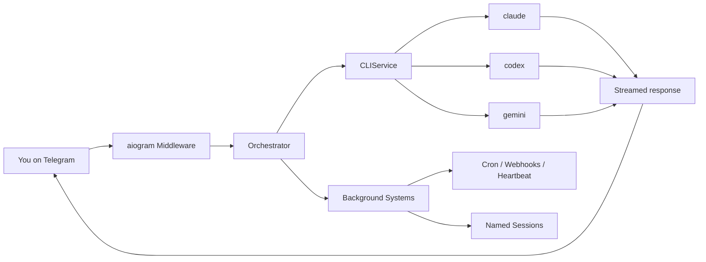

<p align="center">
  
</p>

<p align="center">
  <strong>Claude Code, Codex CLI, and Gemini CLI as your Telegram assistant.</strong><br>
  Named sessions. Persistent memory. Scheduled tasks. Live streaming. Docker sandboxing.<br>
  Uses only official CLIs. Nothing spoofed, nothing proxied.
</p>

<p align="center">
  <a href="https://pypi.org/project/ductor/"></a>
  <a href="https://pypi.org/project/ductor/"></a>
  <a href="https://github.com/PleasePrompto/ductor/blob/main/LICENSE"></a>
</p>

<p align="center">
  <a href="#quick-start">Quick start</a> &middot;
  <a href="#features">Features</a> &middot;
  <a href="#how-it-works">How it works</a> &middot;
  <a href="#telegram-commands">Commands</a> &middot;
  <a href="docs/README.md">Docs</a> &middot;
  <a href="#contributing">Contributing</a>
</p>

---

For developers who want to use AI coding agents from their phone or any Telegram client.

ductor runs on your machine, uses your existing CLI authentication, and keeps state in plain JSON/Markdown under `~/.ductor/`.

<p align="center">
  
  
</p>

## Quick start

```bash
pipx install ductor
ductor
```

The onboarding wizard handles CLI checks, Telegram setup, timezone, optional Docker, and optional background service install.

**Requirements:** Python 3.11+, at least one CLI installed (`claude`, `codex`, or `gemini`), a Telegram Bot Token from [@BotFather](https://t.me/BotFather).

Detailed setup: [`docs/installation.md`](docs/installation.md)

## Features

### Core

- Real-time streaming with live Telegram edits
- Provider/model switching with `/model` (sessions are preserved per provider)
- `@model` directives for inline provider targeting
- Inline callback buttons, queue tracking with per-message cancel
- Persistent memory in plain Markdown

### Named sessions

Run tasks in the background while you keep chatting. Each session gets a unique name and supports follow-ups:

```text
/session Fix the login bug              -> starts "firmowl" on default provider
/session @codex Refactor the parser     -> starts "pureray" on Codex
/session @opus Analyze the architecture -> starts "goldfly" on Claude (opus)
/session @flash Check the logs          -> starts "slimelk" on Gemini (flash)

@firmowl Also check the tests           -> foreground follow-up
/session @firmowl Add error handling     -> background follow-up

/sessions                                -> list/manage active sessions
```

`@model` shortcuts resolve the provider automatically (`@opus` = Claude, `@flash` = Gemini, `@codex` = Codex).

### Automation

- **Cron jobs:** in-process scheduler with timezone support, per-job overrides, quiet hours
- **Webhooks:** `wake` (inject into active chat) and `cron_task` (isolated task run) modes
- **Heartbeat:** proactive checks in active sessions with cooldown + quiet hours
- **Config hot-reload:** safe fields update without restart (mtime-based watcher)

### Infrastructure

- **Service manager:** Linux (systemd), macOS (launchd), Windows (Task Scheduler)
- **Docker sandbox:** sidecar container with configurable host mounts
- **Auto-onboarding:** interactive setup wizard on first run
- **Cross-tool skill sync:** shared skills across `~/.claude/`, `~/.codex/`, `~/.gemini/`

## How it works



The orchestrator routes messages through command dispatch, directive parsing, and conversation flows. Background systems (cron, webhooks, heartbeat, named sessions, config reload, model caches) run as in-process asyncio tasks.

Session behavior:
- Sessions are chat-scoped and provider-isolated
- `/new` resets only the active provider bucket
- Switching providers preserves each provider's session context

## Telegram commands

| Command | Description |
|---|---|
| `/session <prompt>` | Run named background session |
| `/sessions` | View/manage active sessions |
| `/model` | Interactive model/provider selector |
| `/new` | Reset active provider session |
| `/stop` | Abort active run |
| `/status` | Session/provider/auth status |
| `/memory` | Show persistent memory |
| `/cron` | Interactive cron management |
| `/showfiles` | Browse `~/.ductor/` |
| `/diagnose` | Runtime diagnostics |
| `/upgrade` | Check/apply updates |
| `/info` | Version + links |

## CLI commands

```bash
ductor                  # Start bot (auto-onboarding if needed)
ductor stop             # Stop bot
ductor restart          # Restart bot
ductor upgrade          # Upgrade and restart
ductor status           # Runtime status

ductor service install  # Install as background service
ductor service logs     # View service logs

ductor docker enable    # Enable Docker sandbox
ductor docker rebuild   # Rebuild sandbox container
ductor docker mount /path  # Add host mount

ductor api enable       # Enable WebSocket API (beta)
```

Full CLI reference: [`docs/modules/setup_wizard.md`](docs/modules/setup_wizard.md)

## Workspace layout

```text
~/.ductor/
  config/config.json        # Bot configuration
  sessions.json             # Chat session state
  named_sessions.json       # Named background sessions
  cron_jobs.json            # Scheduled tasks
  webhooks.json             # Webhook definitions
  CLAUDE.md / AGENTS.md / GEMINI.md  # Rule files
  logs/agent.log
  workspace/
    memory_system/MAINMEMORY.md      # Persistent memory
    cron_tasks/ skills/ tools/       # Task scripts, skills, tool scripts
    telegram_files/ output_to_user/  # File I/O directories
```

Full config reference: [`docs/config.md`](docs/config.md)

## Documentation

| Doc | Content |
|---|---|
| [Developer Quickstart](docs/developer_quickstart.md) | Fastest path for contributors |
| [Architecture](docs/architecture.md) | Startup, routing, streaming, callbacks |
| [Configuration](docs/config.md) | Config schema and merge behavior |
| [Automation](docs/automation.md) | Cron, webhooks, heartbeat setup |
| [Module docs](docs/modules/) | Per-module deep dives (24 modules) |

## Disclaimer

ductor runs official provider CLIs and does not impersonate provider clients. Validate your own compliance requirements before unattended automation.

- [Anthropic Terms](https://www.anthropic.com/policies/terms)
- [OpenAI Terms](https://openai.com/policies/terms-of-use)
- [Google Terms](https://policies.google.com/terms)

## Contributing

```bash
git clone https://github.com/PleasePrompto/ductor.git
cd ductor
python -m venv .venv && source .venv/bin/activate
pip install -e ".[dev]"
pytest && ruff format . && ruff check . && mypy ductor_bot
```

Zero warnings, zero errors.

## License

[MIT](LICENSE)
