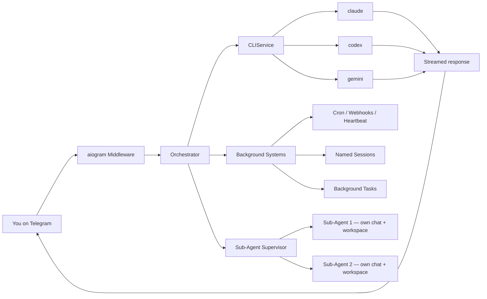

<p align="center">
  
</p>

<p align="center">
  <strong>Claude Code, Codex CLI, and Gemini CLI as your Telegram assistant.</strong><br>
  Named sessions. Persistent memory. Scheduled tasks. Live streaming. Docker sandboxing.<br>
  Uses only official CLIs. Nothing spoofed, nothing proxied.
</p>

<p align="center">
  <a href="https://pypi.org/project/ductor/"></a>
  <a href="https://pypi.org/project/ductor/"></a>
  <a href="https://github.com/PleasePrompto/ductor/blob/main/LICENSE"></a>
</p>

<p align="center">
  <a href="#quick-start">Quick start</a> &middot;
  <a href="#features">Features</a> &middot;
  <a href="#how-it-works">How it works</a> &middot;
  <a href="#telegram-commands">Commands</a> &middot;
  <a href="docs/README.md">Docs</a> &middot;
  <a href="#contributing">Contributing</a>
</p>

---

Use your Claude Max, GPT Pro, or Gemini Pro subscription with ductor. Control your coding agents via Telegram -- automations, cron jobs, named sessions, and more.

ductor runs on your machine, uses your existing CLI authentication, and keeps state in plain JSON/Markdown under `~/.ductor/`.

<p align="center">
  
  
</p>

## Quick start

```bash
pipx install ductor
ductor
```

The onboarding wizard handles CLI checks, Telegram setup, timezone, optional Docker, and optional background service install.

**Requirements:** Python 3.11+, at least one CLI installed (`claude`, `codex`, or `gemini`), a Telegram Bot Token from [@BotFather](https://t.me/BotFather), and either at least one Telegram user ID in `allowed_user_ids` or `group_mention_only=true`.

Detailed setup: [`docs/installation.md`](docs/installation.md)

## Why ductor?

ductor executes the real provider CLIs as subprocesses. No API proxying, no spoofing.

Other projects manipulate SDKs or patch CLIs and risk violating provider terms of service. ductor simply runs the official CLI binaries as if you typed the command in your terminal. Nothing more.

- Official CLIs only (`claude`, `codex`, `gemini`)
- Rule files are plain Markdown (`CLAUDE.md`, `AGENTS.md`, `GEMINI.md`)
- Memory is one Markdown file (`memory_system/MAINMEMORY.md`)
- All state is JSON (`sessions.json`, `named_sessions.json`, `tasks.json`, `cron_jobs.json`, `webhooks.json`, `startup_state.json`, `inflight_turns.json`)

## Features

### Core

- Real-time streaming with live Telegram edits
- Provider/model switching with `/model` (sessions are preserved per provider)
- `@model` directives for inline provider targeting
- Inline callback buttons, queue tracking with per-message cancel
- Persistent memory in plain Markdown
- Restart-aware startup with safe auto-recovery for interrupted work

### Named sessions

Start a separate CLI conversation without polluting your main chat's context — like opening a second terminal window next to your current one. Sessions run inside your main chat but each one has its own isolated context.

```text
/session Fix the login bug              -> starts "firmowl" on default provider
/session @codex Refactor the parser     -> starts "pureray" on Codex
/session @opus Analyze the architecture -> starts "goldfly" on Claude (opus)
/session @flash Check the logs          -> starts "slimelk" on Gemini (flash)

@firmowl Also check the tests           -> foreground follow-up
/session @firmowl Add error handling     -> background follow-up

/sessions                                -> list/manage active sessions
```

`@model` shortcuts resolve the provider automatically (`@opus` = Claude, `@flash` = Gemini, `@codex` = Codex).

**Example:**

```text
You:  "Let's work on the authentication module"
  → Main conversation — Claude builds up context about auth

/session @codex Fix the broken CSV export
  → Completely separate context — doesn't pollute the auth discussion

@firmowl Now add proper error messages too
  → Follow-up goes to the existing "firmowl" session — still separate from main

You:  "Back to auth — now add rate limiting"
  → Main context is still clean, Claude remembers exactly where you left off
```

Think of it as keeping your desk organized: your main chat stays focused on one topic, and sessions handle unrelated work without mixing contexts.

### Background tasks

Every chat — main or sub-agent — can delegate long-running work to background tasks. You keep chatting while the task runs autonomously.

The agent decides on its own when to delegate (anything likely taking >30 seconds), but you can also tell it explicitly. When a task finishes, its full result flows back into your chat context — as if the agent had done the work itself.

```text
You:  "Research the top 5 competitors and write a summary"
  → Agent delegates this to a background task automatically
  → You keep chatting: "While that's running, explain our pricing model"
  → Task finishes → result delivered into your conversation

You:  "Delegate this: generate PDF reports for all Q4 metrics"
  → Explicitly delegated — task starts, you keep chatting
  → Task has a question? It asks the agent, agent asks you, you answer, task continues

/tasks                      -> view/manage all background tasks
```

Each task gets its own memory file (`TASKMEMORY.md`) in the workspace and can be resumed with follow-up prompts. Tasks are isolated per agent — a sub-agent's tasks live in its own workspace.

### Sub-agents

Sub-agents are completely independent Telegram bots — like having ductor installed twice. Each one has its own chat, own workspace, own memory, and own default provider.

**Setup:** Create a second bot via [@BotFather](https://t.me/BotFather), then:

```bash
ductor agents add codex-agent
```

**Example: Claude as main, Codex as sub-agent**

```text
# Two separate Telegram chats — use them independently:
Main chat (Claude):     "Explain the auth flow in this codebase"
codex-agent chat:       "Refactor the parser module"

# They can also talk to each other:
Main chat:  "Ask codex-agent to write tests for the API module"
  → Claude sends the task to Codex
  → Codex works in its own workspace
  → Result flows back into your main chat — Claude sees it and responds

# Background delegation — keep chatting while Codex works:
Main chat:  "Give codex-agent a task: migrate the database schema"
  → Returns immediately, you keep talking to Claude
  → Codex finishes → result delivered to your main chat
```

All agents share knowledge through `SHAREDMEMORY.md` and can delegate background tasks independently.

```text
/agents                     # Status of all agents with current model
/agent_commands             # Full multi-agent command reference
```

### Sessions vs. Background tasks vs. Sub-agents

| | Named sessions | Background tasks | Sub-agents |
|---|---|---|---|
| **Analogy** | Two terminal windows on one desktop | "Work on this while I do something else" | Two separate computers |
| **Chat** | Same Telegram chat | Same Telegram chat | Own Telegram chat |
| **Context** | Own context, separate from main | Own context — result flows back into parent chat | Own context, own workspace, own memory |
| **Workspace** | Shared with main agent | Shared with parent agent (isolated per sub-agent) | Own workspace under `~/.ductor/agents/<name>/` |
| **Provider** | Any — per session | Inherits from parent | Own default provider/model |
| **Follow-ups** | `@name` to continue | Resume with follow-up prompt | Chat directly or delegate from main |
| **Setup** | None — `/session <prompt>` | Automatic — agent decides or you ask | `ductor agents add` + BotFather token |
| **Best for** | Keeping unrelated work out of your main context | Long-running work you don't want to wait for | Dedicated agent with different CLI/provider |

**When to use what:**

- **Named session** — you need to work on something unrelated without polluting your main conversation. "I'm deep in the auth module, but I also need someone to fix that CSV bug — without mixing the two contexts."
- **Background task** — anything that takes a while. Just chat normally and the agent delegates when it makes sense. You can also say explicitly: "Delegate this: ..." The result flows back into your chat as if the agent did it inline.
- **Sub-agent** — you want a dedicated Codex/Gemini/Claude agent with its own workspace, or you want agents that can collaborate across chats.

### Automation

- **Cron jobs:** in-process scheduler with timezone support, per-job overrides, quiet hours
- **Webhooks:** `wake` (inject into active chat) and `cron_task` (isolated task run) modes
- **Heartbeat:** proactive checks in active sessions with cooldown + quiet hours
- **Config hot-reload:** safe fields update without restart (mtime-based watcher)

### Infrastructure

- **Service manager:** Linux (systemd), macOS (launchd), Windows (Task Scheduler)
- **Docker sandbox:** sidecar container with configurable host mounts
- **Multi-agent runtime:** main agent + sub-agents, each with own Telegram bot, workspace, background tasks, shared memory
- **Auto-onboarding:** interactive setup wizard on first run
- **Cross-tool skill sync:** shared skills across `~/.claude/`, `~/.codex/`, `~/.gemini/`

## How it works



The orchestrator routes messages through command dispatch, directive parsing, and conversation flows. Background systems (cron, webhooks, heartbeat, named sessions, background tasks, config reload, model caches) run as in-process asyncio tasks. Sub-agents are managed by a supervisor with crash recovery — each one runs its own full bot stack.

Session behavior:
- Sessions are chat-scoped and provider-isolated
- `/new` resets only the active provider bucket
- Switching providers preserves each provider's session context

## Telegram commands

| Command | Description |
|---|---|
| `/session <prompt>` | Run named background session |
| `/sessions` | View/manage active sessions |
| `/tasks` | View/manage delegated background tasks |
| `/model` | Interactive model/provider selector |
| `/new` | Reset active provider session |
| `/stop` | Abort active run |
| `/stop_all` | Abort active runs across all agents (main agent; local fallback on sub-agents) |
| `/status` | Session/provider/auth status |
| `/memory` | Show persistent memory |
| `/cron` | Interactive cron management |
| `/showfiles` | Browse `~/.ductor/` |
| `/diagnose` | Runtime diagnostics |
| `/upgrade` | Check/apply updates |
| `/agents` | Multi-agent status with current models |
| `/agent_commands` | Multi-agent command reference |
| `/info` | Version + links |

## CLI commands

```bash
ductor                  # Start bot (auto-onboarding if needed)
ductor stop             # Stop bot
ductor restart          # Restart bot
ductor upgrade          # Upgrade and restart
ductor status           # Runtime status

ductor service install  # Install as background service
ductor service logs     # View service logs

ductor docker enable    # Enable Docker sandbox
ductor docker rebuild   # Rebuild sandbox container
ductor docker mount /path  # Add host mount

ductor agents list      # List configured sub-agents
ductor agents add NAME  # Add a sub-agent
ductor agents remove NAME  # Remove a sub-agent

ductor api enable       # Enable WebSocket API (beta)
```

Full CLI reference: [`docs/modules/setup_wizard.md`](docs/modules/setup_wizard.md)

## Workspace layout

```text
~/.ductor/
  config/config.json        # Bot configuration
  sessions.json             # Chat session state
  named_sessions.json       # Named background sessions
  tasks.json                # Background task registry
  startup_state.json        # Startup lifecycle state (restart vs reboot)
  inflight_turns.json       # In-flight foreground turn tracker
  cron_jobs.json            # Scheduled tasks
  webhooks.json             # Webhook definitions
  SHAREDMEMORY.md           # Shared knowledge across all agents
  agents.json               # Sub-agent registry (optional)
  agents/                   # Sub-agent homes/workspaces
  CLAUDE.md / AGENTS.md / GEMINI.md  # Rule files
  logs/agent.log
  workspace/
    memory_system/MAINMEMORY.md      # Persistent memory
    cron_tasks/ skills/ tools/       # Cron task scripts, skills, tool scripts
    tasks/                           # Per-task folders (TASKMEMORY.md + task rules)
    telegram_files/ output_to_user/  # File I/O directories
    api_files/                       # API uploads (dated folders)
```

Full config reference: [`docs/config.md`](docs/config.md)

## Documentation

| Doc | Content |
|---|---|
| [System Overview](docs/system_overview.md) | Fastest end-to-end runtime understanding |
| [Developer Quickstart](docs/developer_quickstart.md) | Fastest path for contributors |
| [Architecture](docs/architecture.md) | Startup, routing, streaming, callbacks |
| [Configuration](docs/config.md) | Config schema and merge behavior |
| [Automation](docs/automation.md) | Cron, webhooks, heartbeat setup |
| [Module docs](docs/modules/) | Per-module deep dives (22 modules) |

## Disclaimer

ductor runs official provider CLIs and does not impersonate provider clients. Validate your own compliance requirements before unattended automation.

- [Anthropic Terms](https://www.anthropic.com/policies/terms)
- [OpenAI Terms](https://openai.com/policies/terms-of-use)
- [Google Terms](https://policies.google.com/terms)

## Contributing

```bash
git clone https://github.com/PleasePrompto/ductor.git
cd ductor
python -m venv .venv && source .venv/bin/activate
pip install -e ".[dev]"
pytest && ruff format . && ruff check . && mypy ductor_bot
```

Zero warnings, zero errors.

## License

[MIT](LICENSE)
